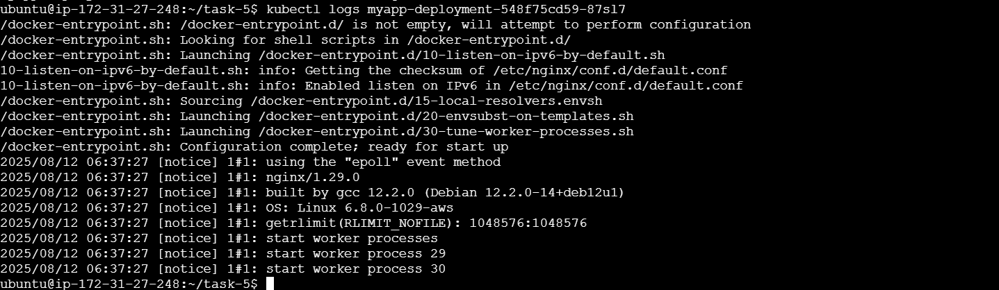

# Kubernetes App Deployment with Minikube (AWS EC2 Ubuntu)

## 📌 Project Overview
This project demonstrates deploying and managing applications in Kubernetes using **Minikube** on an AWS EC2 Ubuntu instance.  
It covers:
- Creating a deployment
- Exposing the service
- Scaling pods
- Accessing the application from a browser
- Viewing pod logs

---

## 🛠 Tools Used
- **Minikube** (local Kubernetes cluster)
- **kubectl** (Kubernetes CLI)
- **Docker** (container runtime)
- **AWS EC2** (Ubuntu 20.04+ instance)





---

## 🚀 Steps to Reproduce

### 1️⃣ Start Minikube
```bash
minikube start --driver=docker

